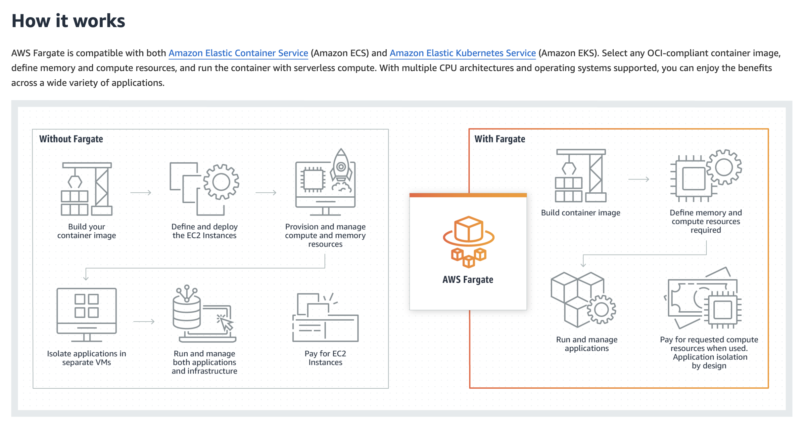

# DEVLOG

This is a place where I can write my thoughts during the app development.

The log will go in reverse chronological order (latest first).

**Disclaimer:** I'm happy to version control this as it's a personal project but in
practice/production I would not publically publish this potentially sensitive
information.

## Tue 10th Dec

- Made the EC2 time_tracker instance IP static
- Added a `ci.sh` script that can be used as a poor-man's script to build, push and run a docker container in EC2

### Improving UI/UX

I have merged the infra CI/CD PR and now working on making the app a bit more pleasing on mobile.

Watching these videos:

- [Table Design Ideas For Mobile. How to Represent Data Tables on Mobile](https://www.youtube.com/watch?v=dfy_8llodDE)
- [Designing Components: Generic vs Specific, or Composable vs Pre-Composed](https://www.youtube.com/watch?v=qculS3r8BYM)

Worth watching this one in full:

- [Learn SvelteKit in 2 hours](https://www.freecodecamp.org/news/learn-sveltekit-full-course/)

Could read this:

- [How to Use Breakpoints for Responsive Web Design](https://www.freecodecamp.org/news/breakpoints-for-responsive-web-design/)

Free Courses:

- [Responsive Web Design Certification](https://www.freecodecamp.org/learn/2022/responsive-web-design/)
- [Data Visualization Certification](https://www.freecodecamp.org/learn/data-visualization/#data-visualization-with-d3)


## Mon 9th Dec

Gonna try using `terraformer` to see if I can import the AWS infrastructure into terraform.

Gave up on that, then tried importing each resource individually and it became a proper pain in the ass so I've opted for the dumb
decision to just delete all my existing AWS infra and start again.

That'll teach me for not verison controlling my `terraform.tfstate`.

Right.

I'm running `terraform apply` again and it is creating 13 resources.

I will have to manually set up the tailscale subnet router again but that's not the end of the world.

Ok, the infrastructure is now good again. Now I am trying to dockerise the app so that I can push it up to ECR and run it on an EC2 instance.

## Sun 8th Dec

Great!

I'm happy with where the app is up to at this point, I'm happy that we have:

- A database in the cloud
- An interface to create tasks
- A UI that reactively updates tasks as they are altered

I just headed out into town to do some shopping and thought I'd go to a café and do some
more coding.

I remembered just as I picked up my laptop that my server would stop running.
Haha. This problem again.

Ok. I am now at a point where I must have the app running in the cloud.

Though, as an aside, I did look at my unused raspberry pi earlier and think... ooooh!
It could be cool to run the app from a server on my raspberry pi at home. The positive of this
is that I wouldn't incur AWS costs. Already for one month of an idle RDS deployment it cost over $20.
The downside would be that I am at the mercy of my home internet. If the internet goes down
for any reason... it happens from time to time! I would lose connection to the app.
Something to consider for future. It would be great to use the raspberry pi and understand how to set
up a server on it.

Anyways, back to the main work. I am going to try to spin up an EC2 instance with terraform
and see if I can run my app on it.

I've created an issue for this:

https://github.com/davidgfitzgerald/time-tracker/issues/8

Let's go!

### Asking God (AKA Chat GPT)

Here's my prompt for god:

> I have a svelte app I am running locally.
>
> I would now like to run the app in the cloud. Specifically with AWS.
>
> I have already set up, configured and deployed a VPC with terraform in the cloud.
>
> Currently it has two nodes. One is an RDS node and the other is an EC2 instance acting as a tailscale subnet router.
>
> I would like to add another node into the cluster, probably another EC2 instance but I am open to options that could reduce cost.
>
> I would like this node to be accessible when I join my tailnet.
>
> My tailscale subnet router runs this command in the AWS VPC:
>
> sudo tailscale up --advertise-routes=172.31.0.0/16 --accept-dns=false
>
> This means new nodes should automatically be accessible by me from my laptop connected to the tailnet.
>
> Help me write the terraform to deploy a container that can run my application and help me consider how I can push my local development code onto the container and re-run it. In a future question I will probably ask you about how can I add CI/CD such that when I push commits, the app is automatically reloaded with the changes.

**Note:** For me to enable `ls ~/Desktop` I had to grant VSCode full disk access in `System Settings`

### Considering Fargate

Following image taken from https://aws.amazon.com/fargate/



Seems like it could be interesting at some point to consider switching out my infrasturcture management for fargate too.
For now, I'll stick with my approach as I've already implemented it but I should be mindful of this as a possible solution to lower
my AWS costs.

Back to the task at hand.

## Sat 7th Dec

Just steamtrained some work in about an hour.

Had some code that was taking parameters from the client to update a task such as the duration and realised this was a problem
because we should never trust the client. It would be incredibly easy to 'hack' and forcibly input tasks with arbitrarily
large durations. Instead, now we calculate the duration on the server when the request comes in.

I also added the `/api/tasks/[id]` endpoint such that the client (and the server) can retrieve an individual task by ID
and also update a task by ID.

## Fri 6th Dec

Back to it after a little while off.

I ran `terraform plan` and was happy to see that the infrastructure had not changed.

I was less happy to receive a bill of `$22.98` despite having not utilised the AWS infrastructure at all
in the last month.

I have reconfigured my `~/.pg_service.conf` and `~/.pgpass` to point to the correct AWS RDS host.

Although I can run the app locally and it will communicate with RDS, once I run the app from a docker
container, I encounter an error. I'm not going to worry about fixing this right now.

### Big Refactor

Made a great refactor to the project and I think it is working way better and smoother and the code looks better and more maintainable.
I was doing some things in dumb ways like couple reponsibility for the clock to create new tasks.

Have understood a lot more about svelte now and how it's operating and started to make some bigger developmental strides.

I also ran the app locally with the DB locally and that worked fine.

Then, all I have to do to point the app to the "prod" aws DB is change the `POSTGRES_HOST` in the `.env` file.

### Next Steps

There is a potential bug I need to solve where the trigger identifies more than one active row in the DB at once which should be impossible.
It might be that I have to implement some DB locking to prevent this.

It also appears that `undefined` could get returned in the list and thus the rendering on `Time.svelte` would beak.

Additionally, I should now look to deploy the application in the cloud such that I can start using it.

When I deploy I'll need to work out how best to do a quick CI style implementation such that I can quickly build and deploy changes to prod.

Another thing that would be fantastic to implement at some point would be synchronising UIs. It may be that I require implementing websockets for this.
It would be fantastic if when I view concurrently on both my phone and laptop that any edits to tasks are pushed out to both of my clients.

By extension, at some point it would be interesting to implement users and authentication but this is a lower priority or maybe never even a priority for me
because I am now forseeing this app being used by anybody asides from me. Who knows, maybe that could end up being the case!

## Wed 13th Nov

## Mon 11th Nov

### Infra

Have now made exec'ing into the RDS DB even simpler.

I created a `~/.pg_service.conf` file and added the following:

```ini
[rds]
host=terraform-20241109232645798400000002.cpzvybhopwhq.us-west-2.rds.amazonaws.com
user=david
dbname=time_tracker
```

such that I can now connect simply with:

```bash
psql service=rds
```

Using `pgcli` also works.

My app now connects to the live RDS instance. I enabled SSL by downloading the `us-west-2-bundle.pem` from here:
https://docs.aws.amazon.com/AmazonRDS/latest/UserGuide/UsingWithRDS.SSL.html#UsingWithRDS.SSL.CertificatesAllRegions

Tidied up the `.tf` files.

Here's a little one-liner to unset `POSTGRES_` vars:

```bash
while IFS='=' read -r var _; do unset "$var"; done < <(env | grep -i postgres)
```

For some reason, after restarting my mac, the env vars were re-set. I'm not sure how that happened. One to look out for again.

### Development

Ok, now I'm going to actually get on with some development.

I'm going to reacquaint myself with how my project is structured.

## Sun 10th Nov

### Morning

Now that we are port forwarding to the RDS instance I am going to attempt running the `schema.sql` and `seed.sql` scripts.

The port forwarding is still running with:

```bash
ssh -L 5432:terraform-20241109232645798400000002.cpzvybhopwhq.us-west-2.rds.amazonaws.com:5432 ec2-user@52.38.14.88 -N
```

I am able to run `.sql` scripts with:

```bash
psql -h localhost -U david -d time_tracker -f src/lib/db/schema.sql
psql -h localhost -U david -d time_tracker -f src/lib/db/seed.sql
```

I made `psql` become available on the CLI by running:

```bash
brew link --force libpq
```

I get prompted for the password each time. To get around this, I am going to try creating a `~/.pgpass` file.

Database connection entries are added in the following format:

```bash
hostname:port:database:username:password
```

Brilliant. That actually works. Now, both `pgcli` and `psql` do not prompt for a password. Lovely.

### Evening

Ok, just going to do a little bit more tonight.

Gonna look into implementing tailscale. At least I know the bastion approach now works, but it would be even nicer
if I could just join my tailnet and then I don't need to worry about anything. I can simply access my app server and DB.

Reading this:

https://tailscale.com/kb/1021/install-aws

> Connect to an AWS VPC using subnet routes

There is also this article

https://tailscale.com/kb/1141/aws-rds

> Access AWS RDS privately using Tailscale

I'm going to go with the latter. I think they are both similar though.

I've created a security group to allow tailscale direct connections through the bastion.

I'm now going to `ssh` into the bastion and install tailscale and then configure subnet routing.

https://tailscale.com/kb/1052/install-amazon-linux-2

I am manually installing and running tailscale but it might be nice to have this automatable. Perhaps could integrate
ansible down the line to install and run tailscale? It feels like it would be out of scope for terraform?

Ok great. That was not actually too painful.

I followed the tutorials and they worked. So the steps were as follows:

1. Add tailscale security group
2. `ssh` into EC2 instance
3. Run these commands to install and run tailscale

```bash
sudo yum install -y yum-utils
sudo yum-config-manager --add-repo https://pkgs.tailscale.com/stable/amazon-linux/2/tailscale.repo
sudo yum install -y tailscale
sudo systemctl enable --now tailscaled
echo 'net.ipv4.ip_forward = 1' | sudo tee -a /etc/sysctl.d/99-tailscale.conf
echo 'net.ipv6.conf.all.forwarding = 1' | sudo tee -a /etc/sysctl.d/99-tailscale.conf
sudo sysctl -p /etc/sysctl.d/99-tailscale.conf
sudo tailscale up --advertise-routes=172.31.0.0/16 --accept-dns=false
```

4. Log into tailscale locally on the GUI to authorise the EC2 instance
5. Login to https://login.tailscale.com/admin locally
6. Follow all the steps in https://tailscale.com/kb/1019/subnets to configure the subnet router
7. Add the AWS DNS to the tailnet to allow this:
   ```bash
   pgcli -h terraform-20241109232645798400000002.cpzvybhopwhq.us-west-2.rds.amazonaws.com -U david -d time_tracker
   ```
8. Remove SSH access to EC2 instance

So, I may need to address this at some point but if terraform ever decides to destroy and re-create the subnet router
then the steps detailed above have to be repeated manually.

For the infrequency that this should occur during my development, let's move on and live with it.

We have everything we need now to actually get on with some development next session. Great!

I also started reading this article which was really interesting
https://tailscale.com/blog/how-tailscale-works

## Sat 9th Nov

Reading into VPC's to understand more about them and see what the best approach of securely allowing connection
from my local machine into the DB will be.

Exploring option of having an EC2 act as a gateway running tailscale.

I have successfully instantiated an EC2 instance that I can connect to via ssh. I am now trying to add an ssh key-pair to it
such that I don't get the Permission denied (publickey) error.

Been struggling for a while just to SSH into an EC2 instance with a key-pair. Will keep trying...

Still trying and still failing. Tried loads of different usernames. Tried generating new keys, using old keys. Still struggling.

Tried running these commands to manually created the key pair and upload it to AWS like so:

```bash
ssh-keygen -t rsa -b 2048 -f ~/.ssh/manual-key.pem -C "manual-key"
```

then

```bash
aws ec2 import-key-pair --key-name "manual-key" --public-key-material fileb://~/.ssh/manual-key.pem.pub
```

but still... I get a `Permission denied (publickey)` error every single time.

```log
~/dev/personal/time-tracker/deployment main *4 !5 ?1 ❯ ssh -i ~/.ssh/manual-key.pem 34.211.150.149                                                                                                  1m 7s
The authenticity of host '34.211.150.149 (34.211.150.149)' can't be established.
ECDSA key fingerprint is SHA256:Z+IHPHBqhd8/rVo6CseU0OXbvnx4zC+HG2XDWLPJA5A.
This key is not known by any other names.
Are you sure you want to continue connecting (yes/no/[fingerprint])? yes
Warning: Permanently added '34.211.150.149' (ECDSA) to the list of known hosts.
david@34.211.150.149: Permission denied (publickey).
~/dev/personal/time-tracker/deployment main *4 !5 ?1 ❯ ssh -i ~/.ssh/manual-key.pem ec2-user@34.211.150.149                                                                                      ✘ 255 4s
ec2-user@34.211.150.149: Permission denied (publickey).
```

Going to try a new AMI image. Was previously using `ami-830c94e3` which I think ChatGPT or a terraform example gave me.
I'm now attempting to use `ami-066a7fbea5161f451` which I found by searching in the Launch Instance screen of EC2
when searching for an AMI. This image is free-tier supported.

FINALLY!

YES.

It actually bloody worked. Ok, there was some issue with the previous image. I suspect that I never managed to get the username correct.
Ah well. We can move on now.

I'm going to watch some YT videos on connecting to RDS locally now.

Now watching this youtube video:

> How can I connect to a private Amazon RDS instance from local system through EC2 as a bastion host?
> https://www.youtube.com/watch?v=ypWzL3PdKx0

Though I'm making progress with the bastion approach I am more interested now in this tailscale tutorial on connecting
to an AWS VPC: https://tailscale.com/kb/1021/install-aws.

When running `terraform apply` with my `key.tf` I found it was repeatedly trying to recreate the key in AWS. Not sure why.

```log
╷
│ Error: importing EC2 Key Pair (macbook-id-rsa): operation error EC2: ImportKeyPair, https response error StatusCode: 400, RequestID: 1790407a-9002-473d-95c5-508ccceda585, api error InvalidKeyPair.Duplicate: The keypair already exists
│
│   with aws_key_pair.macbook_id_rsa,
│   on key.tf line 2, in resource "aws_key_pair" "macbook_id_rsa":
│    2: resource "aws_key_pair" "macbook_id_rsa" {
│
╵
```

Ran this to solve it:

```bash
terraform import aws_key_pair.macbook_id_rsa macbook-id-rsa
```

### Continuing

It is the evening now and I'm gonna give this another go. I can't manage to ssh into the bastion since adding the subnets so I think
the networking is misconfigured somehow.

I'm going to follow this youtube tutorial architecturally and hope it works:

> How to Access a Private RDS Database (Using a Jump Box) From Your Home Network
> https://www.youtube.com/watch?v=buqBSiEEdQc

A jump box is another term for a bastion.

I think a lot of this is clicking now.

Basically in AWS you have a default VPC which defines default public subnets, a main route table associated to each subnet and an intenet gateway.
The RDS instance has to have at least two private subnets so those have to be created, along with a private routing table.

Ok holy shit.

I've done it.

I've configured an RDS DB instance in the cloud that is accessible only by me locally. Fucking hell that was a nightmare. But we got there.

To forward to port `5432` of the RDS instance locally do the following:

```bash
ssh -L 5432:terraform-20241109232645798400000002.cpzvybhopwhq.us-west-2.rds.amazonaws.com:5432 ec2-user@52.38.14.88 -N
```

then, in another shell:

```bash
pgcli -h localhost -U david -d time_tracker
```

Ok great. I'm definitely stopping there for the day. It's 12:30am now, but end on a high, thank god! What a Saturday night eh.

## Fri 8th Nov

### Running Terraform

Running `terraform apply` now successfully provisioned an EC2 instance in the cloud.

Running `terraform destroy` successfully destroyed the EC2 instance:

```log
aws_instance.app_server: Destruction complete after 53s
```

### Creating Postgres DB

Now I'm moving onto actually provisioning the infrastructure I would like to use. A postgres DB
in the cloud. I'm opting to use AWS RDS to deploy the postgres DB but from this page https://aws.amazon.com/rds/faqs/#free-tier it looks to be possible to also use an EC2 Relational Database AMI. It is still not clear to me from the FAQ answer what the real difference is. I see that RDS offloads database administration but
I'm confused by that. Surely I would still be managing the database myself?

> When would I use Amazon RDS vs. Amazon EC2 Relational Database AMIs?
>
> Amazon Web Services provides a number of database alternatives for developers. Amazon RDS enables you to run a fully managed and fully featured relational database while offloading database administration. Using one of our many relational database AMIs on Amazon EC2 allows you to manage your own relational database in the cloud. There are important differences between these alternatives that may make one more appropriate for your use case. See Cloud Databases with AWS for guidance on which solution is best for you.

I cannot use version `13.4` of postgres:

```log
│ Error: creating RDS DB Instance (terraform-20241108190621095100000001): operation error RDS: CreateDBInstance, https response error StatusCode: 400, RequestID: 40d596a5-894d-4563-88d7-693ecb35dbf5, api error InvalidParameterCombination: Cannot find version 13.4 for postgres
```

Also couldn't use the db user name `admin`.

Ran this command to find that the default postgres version that will be installed is `16.3`:

```bash
aws rds describe-db-engine-versions --default-only --engine postgres
```

I have successfully created a postgres DB RDS instance in AWS with terraform!

```log
aws_db_instance.postgres: Creation complete after 5m2s [id=db-ONSYUMTQRPMNGTLJGHQUA4DW7E]

Apply complete! Resources: 1 added, 0 changed, 0 destroyed.

Outputs:

db_instance_endpoint = "terraform-20241108191356213700000001.cpzvybhopwhq.us-west-2.rds.amazonaws.com:5432"
db_instance_id = "db-ONSYUMTQRPMNGTLJGHQUA4DW7E"
```

Now I need to make the RDS DB instance accessible from my laptop. I am trying to add a VPC security group with terraform.

Trying to connect to the RDS instance like so:

```bash
pgcli -h terraform-20241108191356213700000001.cpzvybhopwhq.us-west-2.rds.amazonaws.com -p 5432 -U david -d time_tracker
```

But it is timing out:

```log
~/dev/personal/time-tracker/deployment main *4 !4 ❯ pgcli -h terraform-20241108191356213700000001.cpzvybhopwhq.us-west-2.rds.amazonaws.com -p 5432 -U david -d time_tracker

connection failed: connection to server at "172.31.49.147", port 5432 failed: could not receive data from server: Operation timed out
```

**Note:** I don't care about exposing the host URL or IP because it will not be publically accessible.

Installed `psql` with `brew install libpq`, so I can use that or `pgcli`.

Following this tutorial https://docs.aws.amazon.com/AmazonRDS/latest/UserGuide/USER_ConnectToPostgreSQLInstance.psql.html

Ok, so it worked when I set `publicly_accessible` to `true` but I don't want that. I want to only be privately accessible.

From the answer on this SO thread https://stackoverflow.com/questions/26989887/access-aws-rds-from-private-subnet the user suggests connecting through a client VPN. After asking
ChatGPT how I could leverage tailscale to connect to my RDS DB instance. Basically I would create
an EC2 instance running tailscale, that allows SSH access from my private machine. That instance
would be on the same VPC as the RDS instance. Then when I connect to the tailnet, I should
automatically be able to connect to the RDS instance, in theory. Something to try next time. I would need
to understand whether I could add the tailscale VPN to the VPC itself thus bypassing the need for the
EC2 instance or whether the EC2 instance would be necessary,

## Thu 7th Nov

### Terraform Setup

Created an organisation called `df-personal` here: https://app.terraform.io/app/df-personal.

Created a project called `Time Tracker` and workspace called `time-tracker`.

Ran `terraform login` and generated a token to login on the CLI.

Created `cloud-integration.tf` which defines my cloux organisation and links to the `time-tracker` project.

Re-ran `terraform init` and noticed it has added the environment details.

I still have not yet run `terraform apply`.

Going through this tutorial before generating any infrastructure:
https://developer.hashicorp.com/terraform/tutorials/aws-get-started

Ran `terraform -install-autocomplete`.

- Format `.tf` files with `terraform fmt`
- Validate with `terraform validate`

Running `terraform plan` failed because:

```log
│ Error: failed to refresh cached credentials, no EC2 IMDS role found,
│ operation error ec2imds: GetMetadata, request canceled, context deadline
│ exceeded
```

Spending quite a lot of time getting this error repeatedly. Somehow it seems that the credentials are
not valid.

```log
│ Error: No valid credential sources found
```

So, it appears the problem was that due to the `cloud-integration.tf` file I was specifying to use the terraform cloud
and though the AWS credentials were available locally, I had not configured them in the terraform cloud. For now I will
proceed using terraform locally.

Finally running `terraform apply` with the tutorial infrastructure which should provision an EC2 instance.

Because I changed the AWS region from `us-west-2` to `eu-west-2` I have to find and change the `AMI` (Amazon Machine Image)
specified to avoid this error:

```log
NotFound: The image id '[ami-830c94e3]' does not exist
```

Asked ChatGPT and it suggested `ami-f976839e` for `eu-west-2`.

Actually, ran into weird blocked account when trying to use `eu-west-2` so just going to revert to using `us-west-2` for simplicity.

How frustrating. My AWS has been blocked and I have now opened a support ticket with AWS to unblock my account. That means I can't actually proceed with instantiating infrastructure right now. How annoying:

```log
aws_instance.app_server: Creating...
╷
│ Error: creating EC2 Instance: operation error EC2: RunInstances, https response error StatusCode: 400, RequestID: 96ed64c8-a7eb-4dcc-aec9-dd76fa98b6af, api error Blocked: This account is currently blocked and not recognized as a valid account. Please contact https://support.console.aws.amazon.com/support/home?region=us-east-1#/case/create?issueType=customer-service&serviceCode=account-management&categoryCode=account-verification if you have questions.
│
```

I'm gonna stop for the day. Spent 2hr20m trying to just instantiate some AWS infrastructure with (and without) terraform. Sigh. It would be nice
to actually do some app development. Oh well, we solider on. We will get there.

## Wed 6th Nov

### Deployment

I am currently tackling deploying a postgres DB to the cloud. I am experimenting with using Terraform to deploy a free-tier 12-month
AWS RDS DB on-demand compute unit. I just want something that I can forget about and won't kill me with fees at the end of the 12-month
period. It looks like a `db.t3.micro` instance would cost 1.09 USD per month if it is used 2/24 hours a day. I think that might be realistic?

For now, I am going to carry on.

I need to make a note that on Nov 6th 2025 the DB will start incurring costs.

I created the `deployment` directory and then ran `terraform init` within. I added `.terraform` to the `.gitignore`. The `.terraform.lock.hcl` file
has the required information that would mean `terraform init` uses the same provider version. In practice this is only one aws provider. I could
commit `.terraform` but to keep things smaller I decided not to.

In future I might move the `deployment` out to it's own repo but in the interest of development speed, I've kept it all in once repo.

I also looked into Supabase which seemed like a good option for my needs but since my new job will be using AWS I thought it a good opportunity
to familiarise myself with more of AWS's idiosyncrasies.

#### Progress

I created the `main.tf` and `variables.tf` files with the help of ChatGPT. The goal of these files being to create and then manage the RDS postgres instance in AWS.

So I created new credentials in AWS. I just created a key for my root user as I'm only using this for development. In practice
the recommended route is via IAM Identify Center.

I added these credentials with `aws configure`.

This now means that `terraform plan` works and shows what would be created when running `terraform create` which is where I should probably
start next development session.
